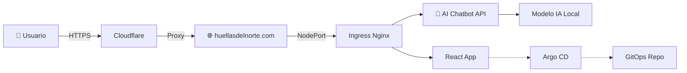

<div align="center">

# 🚀 Huellas del Norte - Cloud Platform
### Plataforma Cloud-Native de Producción en OCI Always Free

[](https://cloud.oracle.com/)
[](https://kubernetes.io/)
[](https://k3s.io/)
[](https://react.dev/)
[](https://cloudflare.com/)

[](https://opensource.org/licenses/MIT)
[](https://huellasdelnorte.com)
[](https://www.oracle.com/cloud/free/)

**Infraestructura cloud empresarial + Web moderna con IA local**  
**Todo desplegado en Oracle Cloud Infrastructure - Tier Always Free**

[🌐 huellasdelnorte.com](https://huellasdelnorte.com) • [📚 Documentación](https://github.com/mikelapestegia/Oracle_Cloud_Infrastructure_Always_Free/blob/main/README.md#-tabla-de-contenidos) • [🚀 Quick Start](https://github.com/mikelapestegia/Oracle_Cloud_Infrastructure_Always_Free/blob/main/README.md#-quick-start) • [📊 Estado](https://github.com/mikelapestegia/Oracle_Cloud_Infrastructure_Always_Free/blob/main/README.md#-estado-del-proyecto)

</div>

---

## 🎯 Acerca del Proyecto

**Huellas del Norte** es una plataforma cloud-native completa que demuestra cómo construir una infraestructura de producción empresarial sin costo alguno, combinando:

- 📡 **Infraestructura cloud robusta** - Kubernetes (k3s) en OCI Always Free
- 🌐 **Aplicación web moderna** - React con chatbot de IA local desplegada en [huellasdelnorte.com](https://huellasdelnorte.com)
- 🔒 **Seguridad y GitOps** - TLS automático, Argo CD, monitoring completo
- 🤖 **Inteligencia Artificial** - Chatbot con modelo local ejecutándose en el cluster

### ✨ Características Destacadas



---

## 📋 Tabla de Contenidos

- [🎯 Acerca del Proyecto](#-acerca-del-proyecto)
- [💡 Componentes Principales](#-componentes-principales)
  - [🌐 Aplicación Web - huellasdelnorte.com](#-aplicación-web---huellasdelnortecom)
  - [📡 Infraestructura Cloud](#-infraestructura-cloud)
  - [🤖 Chatbot con IA Local](#-chatbot-con-ia-local)
- [🏗️ Arquitectura](#%EF%B8%8F-arquitectura)
- [✅ Estado de Implementación](#-estado-de-implementación)
- [🚀 Quick Start](#-quick-start)
- [📊 Métricas y Monitoreo](#-métricas-y-monitoreo)
- [📚 Documentación](#-documentación)
- [🔧 Stack Tecnológico](#-stack-tecnológico)
- [💰 Costos y ROI](#-costos-y-roi)
- [📨 Roadmap](#-roadmap)
- [🤝 Contribuir](#-contribuir)

---

## 💡 Componentes Principales

### 🌐 Aplicación Web - huellasdelnorte.com

<div align="center">

[](https://huellasdelnorte.com)

</div>

**Sitio web moderno construido con React y desplegado en el cluster k3s**

#### ✨ Características de la Web

- ✅ **Framework**: React 18+ con Hooks modernos
- ✅ **Dominio**: `huellasdelnorte.com` gestionado por Cloudflare
- ✅ **SSL/TLS**: Certificados automáticos con cert-manager + Let's Encrypt  
- ✅ **CDN**: Cloudflare para optimización global y protección DDoS
- ✅ **Responsive**: Diseño adaptable a todos los dispositivos
- 🔄 **CI/CD**: Despliegue automático vía Argo CD

#### 🤖 Chatbot Inteligente

```yaml
Chatbot:
  Modelo: Ejecutado localmente en el cluster (ej: LLaMA, Mistral)
  Backend: API Python/Node.js en Kubernetes
  Frontend: Componente React integrado
  Características:
    - Respuestas en tiempo real
    - Contexto conversacional
    - Sin dependencias cloud externas
    - Privacidad total (datos no salen del cluster)
```

**Tecnologías del Chatbot:**
- 🧠 Modelo de IA local (ollama, llama.cpp, etc.)
- 🐍 API Backend en Python/FastAPI o Node.js
- ⚛️ Interfaz React con WebSocket para streaming
- 📊 Monitoring de uso y rendimiento
