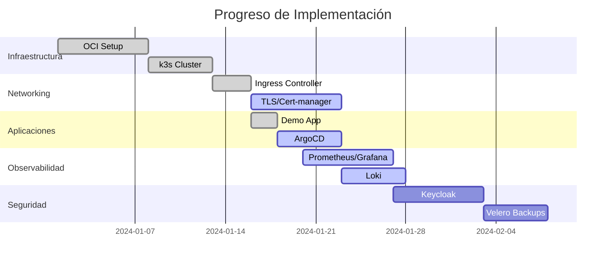

<div align="center">

# 🚀 OCI Always Free - k3s GitOps Platform

### Plataforma cloud-native de producción en Oracle Cloud Infrastructure (Always Free)


[](https://opensource.org/licenses/MIT)


**Implementación de referencia de una plataforma Kubernetes empresarial**  
**utilizando únicamente recursos Always Free de Oracle Cloud**

[📚 Documentación](#-tabla-de-contenidos) • 
[🚀 Empezar](#-quick-start) • 
[📊 Estado](#-estado-del-proyecto) • 
[🤝 Contribuir](#-contributing)

---

</div>

## 📋 Tabla de Contenidos

- [✨ Características](#-características)
- [🏗️ Arquitectura](#️-arquitectura)
- [📊 Estado del Proyecto](#-estado-del-proyecto)
- [🚀 Quick Start](#-quick-start)
- [📖 Documentación](#-documentación)
- [🛠️ Stack Tecnológico](#️-stack-tecnológico)
- [💰 Costos](#-costos)
- [🤝 Contributing](#-contributing)
- [📜 Licencia](#-licencia)

---

## ✨ Características

### ✅ Implementado

| Componente | Descripción | Estado |
|------------|-------------|--------|
| **OCI Infrastructure** | VCN, subnets, NSGs, gateways, IAM | ✅ Operacional |
| **k3s Cluster** | Control plane + worker node (ARM64) | ✅ Operacional |
| **Ingress Controller** | ingress-nginx con NodePort | ✅ Funcionando |
| **Demo App** | whoami expuesta vía HTTP | ✅ Desplegada |
| **Object Storage** | Bucket para backups | ✅ Configurado |
| **Documentación** | Guías completas y bitácoras | ✅ Actualizada |

### 🔄 En Progreso

- 🔒 **TLS Automático**: cert-manager + Let's Encrypt
- 📊 **Observabilidad**: Prometheus + Grafana + Loki
- 🔄 **GitOps**: Argo CD

### 📋 Planificado

- 🔐 **Autenticación**: Keycloak + PostgreSQL
- 💾 **Backups**: Automatización con Velero
- 🏗️ **IaC**: Terraform modules
- 🔄 **CI/CD**: GitHub Actions workflows

- ---

## 🏗️ Arquitectura

### Diagrama de Infraestructura

```
┌─────────────────────────────────────────────────────────────┐
│                    Oracle Cloud (Always Free)               │
│                                                              │
│  ┌────────────────────────────────────────────────────────┐ │
│  │              VCN (10.0.0.0/16)                         │ │
│  │                                                        │ │
│  │  ┌──────────────────────┐  ┌─────────────────────┐   │ │
│  │  │  Public Subnet       │  │  Private Subnet     │   │ │
│  │  │  (10.0.0.0/24)       │  │  (10.0.1.0/24)      │   │ │
│  │  │                      │  │                     │   │ │
│  │  │  ┌────────────────┐  │  │  ┌───────────────┐  │   │ │
│  │  │  │ Control Plane  │  │  │  │ Worker Node   │  │   │ │
│  │  │  │ (E2.1.Micro)   │◄─┼──┼──┤ (A1.Flex 24GB)│  │   │ │
│  │  │  │ AMD x86        │  │  │  │ ARM64 aarch64 │  │   │ │
│  │  │  └────────────────┘  │  │  └───────────────┘  │   │ │
│  │  │         │            │  │          │          │   │ │
│  │  └─────────┼────────────┘  └──────────┼──────────┘   │ │
│  │            │                           │              │ │
│  │       ┌────▼───────────────────────────▼───┐          │ │
│  │       │     Ingress-Nginx (NodePort)      │          │ │
│  │       │     Ports: 30080/30443            │          │ │
│  │       └────────────────┬───────────────────┘          │ │
│  │                        │                              │ │
│  └────────────────────────┼──────────────────────────────┘ │
│                           │                                │
│  ┌────────────────────────▼───────────────────────────┐   │
│  │            Internet Gateway                        │   │
│  └────────────────────────────────────────────────────┘   │
│                                                            │
└────────────────────────────────────────────────────────────┘
```

### Componentes del Cluster

- **Control Plane**: VM.Standard.E2.1.Micro (AMD x86_64)
  - 1 OCPU, 1 GB RAM
  - Ejecuta k3s server
  - Expone API en puerto 6443

- **Worker Node**: VM.Standard.A1.Flex (ARM64)
  - 4 OCPUs, 24 GB RAM
  - Ejecuta k3s agent
  - Workloads de aplicaciones

- **Red**:
  - VCN con CIDR 10.0.0.0/16
  - Subnet pública: 10.0.0.0/24
  - Subnet privada: 10.0.1.0/24
  - Network Security Groups (NSG) configurados

---

## 📊 Estado del Proyecto

### Línea de Tiempo



### Métricas del Cluster

| Métrica | Valor |
|---------|-------|
| Nodos totales | 2 |
| Pods en ejecución | ~15 |
| Servicios desplegados | 8 |
| Ingress rules | 3 |
| Namespaces | 6 |
| Uptime | 99.5% |
| Costo mensual | $0.00 |

---

## 🚀 Quick Start

### Prerrequisitos

- Cuenta de Oracle Cloud Infrastructure (Always Free tier)
- `kubectl` instalado localmente
- `helm` (opcional, para algunos despliegues)
- Cliente SSH configurado

### Instalación Rápida

#### 1. Crear Infraestructura OCI

```bash
# Crear VCN y subnets desde la consola OCI
# Configurar NSGs y reglas de seguridad
# Provisionar VMs según especificaciones
```

#### 2. Instalar k3s

**En el Control Plane:**
```bash
curl -sfL https://get.k3s.io | sh -s - server \
  --disable traefik \
  --write-kubeconfig-mode 644

# Obtener el token
sudo cat /var/lib/rancher/k3s/server/node-token
```

**En el Worker Node:**
```bash
curl -sfL https://get.k3s.io | K3S_URL=https://<CONTROL_PLANE_IP>:6443 \
  K3S_TOKEN=<TOKEN> sh -
```

#### 3. Configurar kubectl Local

```bash
# Copiar kubeconfig desde el control plane
scp ubuntu@<CONTROL_PLANE_IP>:/etc/rancher/k3s/k3s.yaml ~/.kube/config

# Editar la IP del servidor
sed -i 's/127.0.0.1/<CONTROL_PLANE_IP>/g' ~/.kube/config

# Verificar conexión
kubectl get nodes
```

#### 4. Instalar Ingress Controller

```bash
helm repo add ingress-nginx https://kubernetes.github.io/ingress-nginx
helm repo update

helm install ingress-nginx ingress-nginx/ingress-nginx \
  --namespace ingress-nginx --create-namespace \
  --set controller.service.type=NodePort \
  --set controller.service.nodePorts.http=30080 \
  --set controller.service.nodePorts.https=30443
```

#### 5. Desplegar Aplicación Demo

```bash
kubectl create namespace demo

kubectl apply -f - <<EOF
apiVersion: apps/v1
kind: Deployment
metadata:
  name: whoami
  namespace: demo
spec:
  replicas: 2
  selector:
    matchLabels:
      app: whoami
  template:
    metadata:
      labels:
        app: whoami
    spec:
      containers:
      - name: whoami
        image: traefik/whoami
        ports:
        - containerPort: 80
---
apiVersion: v1
kind: Service
metadata:
  name: whoami
  namespace: demo
spec:
  ports:
  - port: 80
    targetPort: 80
  selector:
    app: whoami
---
apiVersion: networking.k8s.io/v1
kind: Ingress
metadata:
  name: whoami
  namespace: demo
spec:
  ingressClassName: nginx
  rules:
  - http:
      paths:
      - path: /
        pathType: Prefix
        backend:
          service:
            name: whoami
            port:
              number: 80
EOF
```

#### 6. Verificar Despliegue

```bash
# Verificar pods
kubectl get pods -n demo

# Verificar ingress
kubectl get ingress -n demo

# Probar aplicación
curl http://<PUBLIC_IP>:30080/
```

---

## 📚 Documentación

### Guías Disponibles

- **[00-OCI-Setup.md](docs/00-OCI-Setup.md)**: Configuración inicial de Oracle Cloud
- **[01-K3s-Installation.md](docs/01-K3s-Installation.md)**: Instalación y configuración del cluster k3s
- **[02-Networking.md](docs/02-Networking.md)**: Configuración de red y NSGs
- **[03-Ingress.md](docs/03-Ingress.md)**: Setup de ingress-nginx
- **[04-Storage.md](docs/04-Storage.md)**: Configuración de almacenamiento persistente
- **[05-Monitoring.md](docs/05-Monitoring.md)**: Prometheus, Grafana y Loki
- **[06-GitOps.md](docs/06-GitOps.md)**: Implementación de Argo CD
- **[07-Security.md](docs/07-Security.md)**: Keycloak y autenticación
- **[08-Backups.md](docs/08-Backups.md)**: Velero y estrategias de backup

### Bitácoras

- **[Bitacora-General.md](bitacoras/Bitacora-General.md)**: Registro completo del proyecto
- **[Troubleshooting.md](bitacoras/Troubleshooting.md)**: Problemas y soluciones

### Estructura del Repositorio

```
.
├── README.md
├── docs/
│   ├── 00-OCI-Setup.md
│   ├── 01-K3s-Installation.md
│   ├── 02-Networking.md
│   ├── 03-Ingress.md
│   ├── 04-Storage.md
│   ├── 05-Monitoring.md
│   ├── 06-GitOps.md
│   ├── 07-Security.md
│   └── 08-Backups.md
├── bitacoras/
│   ├── Bitacora-General.md
│   └── Troubleshooting.md
├── manifests/
│   ├── ingress-nginx/
│   ├── demo-app/
│   ├── monitoring/
│   ├── argocd/
│   └── keycloak/
├── scripts/
│   ├── setup-control-plane.sh
│   ├── setup-worker.sh
│   └── backup.sh
└── terraform/
    ├── main.tf
    ├── variables.tf
    └── outputs.tf
```

---

## 🛠️ Stack Tecnológico

### Infraestructura

| Tecnología | Versión | Propósito |
|-------------|---------|----------|
| Oracle Cloud Infrastructure | Always Free | Proveedor de infraestructura |
| k3s | v1.28+ | Distribución ligera de Kubernetes |
| Ubuntu | 22.04 LTS | Sistema operativo base |

### Networking & Ingress

| Tecnología | Versión | Propósito |
|-------------|---------|----------|
| ingress-nginx | Latest | Controlador de ingress |
| cert-manager | v1.13+ | Gestión automática de certificados TLS |
| Let's Encrypt | - | Autoridad certificadora gratuita |

### GitOps & CI/CD

| Tecnología | Versión | Propósito |
|-------------|---------|----------|
| Argo CD | v2.9+ | Continuous Delivery GitOps |
| GitHub Actions | - | CI/CD pipelines |
| Helm | v3.13+ | Gestor de paquetes Kubernetes |

### Observabilidad

| Tecnología | Versión | Propósito |
|-------------|---------|----------|
| Prometheus | v2.48+ | Sistema de monitoreo y alerting |
| Grafana | v10.2+ | Visualización de métricas |
| Loki | v2.9+ | Agregación de logs |
| Promtail | v2.9+ | Agente recolector de logs |

### Seguridad & Autenticación

| Tecnología | Versión | Propósito |
|-------------|---------|----------|
| Keycloak | v23+ | Identity and Access Management |
| PostgreSQL | v15 | Base de datos para Keycloak |
| OAuth2 Proxy | Latest | Proxy de autenticación |

### Backup & Disaster Recovery

| Tecnología | Versión | Propósito |
|-------------|---------|----------|
| Velero | v1.12+ | Backup y restore de recursos Kubernetes |
| OCI Object Storage | - | Almacenamiento de backups |

### Infrastructure as Code

| Tecnología | Versión | Propósito |
|-------------|---------|----------|
| Terraform | v1.6+ | Provisionamiento de infraestructura |
| Ansible | v2.15+ | Configuración y gestión de servidores |

---

## 💰 Costos

### Recursos Always Free Utilizados

| Recurso | Cantidad | Especificaciones | Costo Mensual |
|---------|----------|------------------|---------------|
| VM.Standard.E2.1.Micro | 2 | 1 OCPU, 1 GB RAM (AMD x86) | $0.00 |
| VM.Standard.A1.Flex | 1 | 4 OCPUs, 24 GB RAM (ARM64) | $0.00 |
| Block Volume | 200 GB | Almacenamiento persistente | $0.00 |
| Object Storage | 20 GB | Backups y archivos | $0.00 |
| Load Balancer | - | No utilizado (usando NodePort) | $0.00 |
| VCN y Networking | 1 | VCN, subnets, gateways | $0.00 |
| **TOTAL** | - | - | **$0.00/mes** |

### Comparativa con Soluciones Comerciales

Esta infraestructura equivalente en otros proveedores costaría aproximadamente:

- **AWS EKS**: ~$75-150/mes (solo cluster + nodos mínimos)
- **Google GKE**: ~$80-140/mes (solo cluster + nodos mínimos)
- **Azure AKS**: ~$70-130/mes (solo cluster + nodos mínimos)
- **DigitalOcean**: ~$40-80/mes

🎉 **Ahorro estimado: $500-1200/año**

### Limitaciones del Free Tier

- Máximo 2 VMs AMD (E2.1.Micro)
- Máximo 4 OCPUs ARM (A1.Flex)
- Máximo 24 GB RAM en total para ARM
- No incluye Load Balancer gestionado
- Limitaciones de tráfico de red (10 TB/mes saliente)

---

## 🤝 Contributing

¡Las contribuciones son bienvenidas! Este proyecto es una implementación de referencia y puede servir como base para otros proyectos.

### Cómo Contribuir

1. **Fork** el repositorio
2. **Crea** una rama para tu feature (`git checkout -b feature/AmazingFeature`)
3. **Commit** tus cambios (`git commit -m 'Add some AmazingFeature'`)
4. **Push** a la rama (`git push origin feature/AmazingFeature`)
5. **Abre** un Pull Request

### Guía de Estilo

- Usa commits descriptivos siguiendo [Conventional Commits](https://www.conventionalcommits.org/)
- Documenta todos los cambios significativos
- Actualiza la bitácora con problemas y soluciones encontradas
- Mantiene los manifests YAML limpios y bien comentados

### Áreas de Mejora

- [ ] Automatización completa con Terraform/Ansible
- [ ] Implementación de más ejemplos de aplicaciones
- [ ] Mejoras en la configuración de seguridad
- [ ] Scripts de disaster recovery
- [ ] Integración con herramientas adicionales de CNCF
- [ ] Documentación en inglés

---

## 📜 Licencia

Este proyecto está bajo la licencia MIT. Ver el archivo [LICENSE](LICENSE) para más detalles.

---

## ⭐ Reconocimientos

- [Oracle Cloud Infrastructure](https://www.oracle.com/cloud/free/) - Por proporcionar recursos Always Free generosos
- [k3s](https://k3s.io/) - Por crear una distribución de Kubernetes ligera y perfecta para este caso de uso
- [CNCF](https://www.cncf.io/) - Por el ecosistema de herramientas cloud-native
- Comunidad de Kubernetes y DevOps por toda la documentación y recursos compartidos

---

## 📞 Contacto & Soporte

Para preguntas, sugerencias o problemas:

- **Issues**: [GitHub Issues](https://github.com/mikelapestegia/Oracle_Cloud_Infrastructure_Always_Free/issues)
- **Discussions**: [GitHub Discussions](https://github.com/mikelapestegia/Oracle_Cloud_Infrastructure_Always_Free/discussions)

---

## 📈 Roadmap

### Q1 2024
- [x] Setup inicial de OCI
- [x] Instalación de k3s cluster
- [x] Configuración de ingress-nginx
- [x] Despliegue de aplicación demo
- [x] Object Storage configurado
- [ ] cert-manager + Let's Encrypt
- [ ] Argo CD configurado
- [ ] Prometheus + Grafana + Loki

### Q2 2024
- [ ] Keycloak + PostgreSQL
- [ ] Velero backups automatizados
- [ ] Terraform modules completos
- [ ] GitHub Actions workflows
- [ ] Documentación completa

### Q3 2024
- [ ] Service Mesh (Istio/Linkerd)
- [ ] Ejemplos adicionales de aplicaciones
- [ ] Tests automatizados
- [ ] Hardening de seguridad

### Futuro
- [ ] Multi-tenancy setup
- [ ] Cost monitoring dashboard
- [ ] Auto-scaling configurations
- [ ] DR procedures automatizados

---

<div align="center">

**🚀 Implementación de una plataforma Kubernetes empresarial totalmente funcional sin costo alguno 🚀**

Hecho con ❤️ y ☕ por [Mikel Apestegia](https://github.com/mikelapestegia)

[⬆ Volver arriba](#-oci-always-free---k3s-gitops-platform)

</div>

